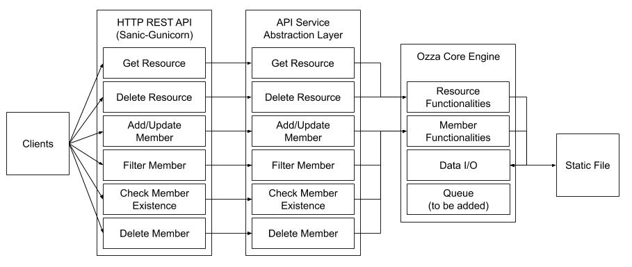

# Ozza Store

In sanscrit, Ozza has a hardworking and helpful trait. This engine is designed to do that.
Ozza is a Key-Value store engine with a HTTP Interface.

There are 2 main concepts around it.

* Resource</br>Resource is the main resource grouping, think of it as a table database. A resource will always return a list of members even though the list can be empty.
* Member</br>Member is the entity assigned to a resource. It's a dictionary that can take any form you wish. The only thing required is to have an `id` field.

On a high level, this is how the Ozza Engine overview



Clients will access via HTTP REST API. The REST API will then talk to an API service which is just an abstraction layer to ensure that the REST API contract does not need to change if there's a change in the Ozza Core Engine contract. The service layer will then talks with the resource functionalities and member functionalities in the core engine. The resource and member functionalities will then talks with the Data I/O functionalities that will persist the data to a static file.

This solution is developed using python for it's simplicity. This will enable faster iteration until a solid iteration is implemented. Sanic was chosen over Flask and Django for it's ability to handle more concurrent requests due to it's async nature. The use of UVLoop in Sanic enables the machine to handle more concurrent requests compared to the standard asyncio. This enabled better vertical scaling capability in a single machine before going for horizontal scaling.

## Requirements

* Python3.7
* Sanic
* Gunicorn
* Nosetests

## Installation

Install virtualenv if you haven't yet

```
$ sudo easy_install pip # If you haven't installed pip yet
$ sudo pip install virtualenv # If you haven't installed virtualenv yet
```

Install dependencies

```
$ virtualenv -p python3 env
$ source env/bin/activate
$ pip install -r requirements.txt
```

### Running App

```
$ ./docker/start.sh run
```

### Testing App

```
$ ./docker/start.sh run
```
### Environment Variables

* `DATA_DIRECTORY` the directory location for the storage file
* `DATA_FILENAME` the filename for the storage file

### Running with docker

To run this with docker, the dockerfile is available inside the `docker/` directory

## HTTP API

The following APIs are available:

### GET /{resource}

This will fetch all the member of the keys.
<br/>Filtering function is also available using `/{resource}?filter=word` or use the `*` wilcard to return any matching in between the character `/{resource}?filter=w*d`
<br/>Will return empty result if member not found or resource group not found.
### PUT /{resource}
This will create a new member in the resource. Requires a JSON body payload with `Content-Type: Application/json` header.<br/>JSON body must have `id` field. Other than that field the JSON structure is free.
<br/>Expiry time can be set by doing PUT `/{resource}?expire_in=[time]`. Time unit is in minutes.
<br/>This is an upsert functionality. If you put the same `id` value in the same resource, the value will be updated.
### DELETE /{resource}
This will delete the resource along with all the member data. Handle with care 😎
### HEAD /{resource}/{id}
This will check if a given member `id` value existed in the resource. Will return `200` status code with no content if the member exist and will return `204` status code with no content if the member does not exist

### DELETE /{resource}/{id}
This will delete a specific member from the resource

## Test Environment

This solution has been tested on:

* MacOS 10.15.5
* MacOS 10.13.1
* Ubuntu 16.04
* Alpine Linux (via docker)

## Further Development

The following things still needs to be done:

* Introduce a processing queue in core engine for data integrity
* Improve core engine performance for data I/O using Cython or PyPy
* Revisit core engine structure once the functionality is completed


